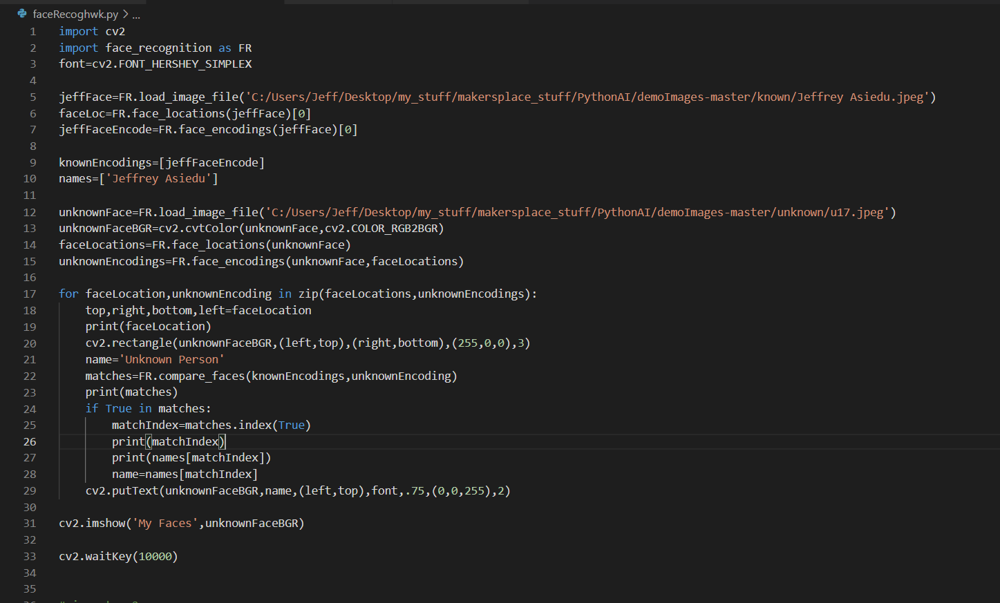
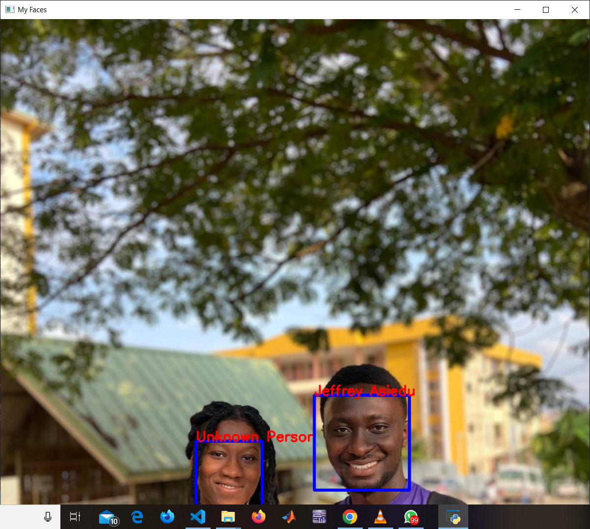
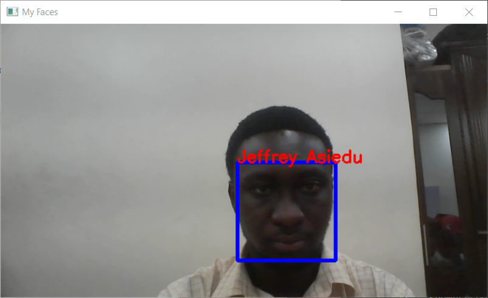

# (Samaritan) - AI Personal Assistant For Home Automation Using Python and Arduino


Samaritan is an AI Personal Assistant built with the Python Programming language and interfaced with the Arduino microcontroller for controlling electrical/electronic components (e.g. fan, lamps etc.) 
Employs computer vision specifically, facial recognition, to identify its user as well as speech recognition algorithms to make meaning of the commands given by the user and then communicates with the Arduino microcontroller for the required actuation to be executed

## Acknowledgements
In order to build this project, I found various resources from different instructors for implementing the different aspects of the project which come together to make the entire project function as it should.
 - [Kevin McAleer](https://github.com/kevinmcaleer): As a first step, I had to build an AI backbone (that is an AI class with the relevant methods). By following the first tutorial of his [Build Your Own AI Personal Assistant](https://www.youtube.com/playlist?list=PLU9tksFlQRirGvp7qOGrrU1PwcjgV8TG1) playlist, I was able to create my AI assistant.
 - Paul McWhorter: Another useful feature to be implemented was to allow for communication between Python and Arduino. By following the third tutorial video of his [Using Python With Arduino](https://www.youtube.com/playlist?list=PLGs0VKk2DiYzWURfJCbCGPa8HI0APjBfo) Youtube Playlist, I was able to write the relevant code to ensure that there was successful communication between Python and Arduino
Again, as a security measure, I wanted to utilize Facial Recognition as a way of granting user access to only those recognized by the system. By following Lesson 16 of his [AI for Everyone](https://www.youtube.com/playlist?list=PLGs0VKk2DiYyXlbJVaE8y1qr24YldYNDm) Youtube Playlist, I was able to build an OpenCV model that could detect my face from among different faces.

## Authors

- [@ziegler121](https://www.github.com/ziegler121)

## Repository Contents
* **ard_AI/** - This directory contains the Arduino code that must be uploaded to the board to facilitate reception of sent data from Python
* **images/** - For keeping certain relevant images
* **ai.py** - This contains code for the backbone of the ai Class (containing methods for Speech Recognition) 
* **arduino.py** - This contains code for passsing data from Python to Arduino
* **faceRecog.py** - Code for implementing Facial recognition
* **Train_Test_Images/** - Contains pictures for training the Facial Recognition model as well as pictures for testing the accuracy of the model.
* **pyduino.py** - Major code for running the entire project is found here. It calls the other 'code pieces' as modules and implements them in a coherent manner

## Things used in this project
### Hardware Components
- Raspberry Pi (preferably); but can also be done on a PC (Windows, Mac, or Linux)
- Microphone - to enable Python hear speech
- Speaker - since we need to hear what is being said
- Arduino Nano
- LEDs
- DC Motor
- Servo Motor
- DHT 11 Temperature and Humidity Sensor
- Breadboard

### Software Apps and Online Services
- [Arduino IDE](https://www.arduino.cc/en/software)
- [Visual Studio Code](https://code.visualstudio.com/download)
- [Python](https://www.python.org/downloads/) : For this project, python version 3.7.9 was utilized

## Architecture
The Architecture used for this particular AI Assistant is quite a simple one with three major components:
- Speech Engine: Useful for recognizing words from audio data as well as making the AI Assistant say things back. (ie. Speech-to-Text and Text-to-Speech functions)
- Facial Recognition: This allows the system to give access to only a particular set of recognized faces.
- Home Automation Skill: This is where the Arduino Microcontroller is utilized to perform certain automation functions based on what the user says it should do

### Creating the AI backbone (implementing the Speech Engine)
#### Methodology
1. ***Creating Virtual Environment***: It is appropriate to create a virtual environment for this particular project to ensure that installations done within this project do not interfere with other versions of python installed on the system.

Open your project folder within a terminal (perferably VS Code terminal) and in your working directory, make the virtual environment using:
```bash
  py -3.7 -m venv [name of virtual env]
```
Then activate the virtual environment using:
```bash
  [name of virtual env]/Scripts/activate
```
***NOTE***: Make sure the right Virtual Environment interpreter is selected in VS Code

2. ***Installation of relevant libraries***:There is the need to also install some relevant libraries at this stage using:
```bash
  pip install pyttsx3
  pip install speechrecognition
  pip install pyaudio
```

The final code for this section can be found in **ai.py**


### Python-Arduino Communication
One very important aspect of this project is to ensure communication between the Python and Arduino sides of the project; such that when speech is recognized using the Python code, data can be send to the Arduino to perform the specific actuation as the user has commanded.
The ***pyserial*** library is needed for such tasks so if not installed, it can be installed using:
```bash
  pip install pyserial
```

The Python code written to send data to Arduino can be found in **arduino.py** and the Arduino code to receive the incoming data to perform the corresponding action is also found in the **ard_AI/** directory.

### Facial Recognition
#### Methodology
1. To begin with, certain libraries which are needed for this project to work were installed using pip. To install them in the specific versions I used, the codes below can be used:
```bash
  pip install Cmake
  pip install opencv-python==4.5.3.56
  pip install face_recognition==1.2.3
```
2. With these libraries installed, I created folders within **Train_Test_Images/** directory of to hold the pictures for training the model as well as the pictures for testing the accuracy of my model in detecting the faces it was trained on. The folders were named **known** and **unknown**; where training images are put in the **known** folder and vice versa

3. Code was then written to first train the model using the face recognition library and then test the model with some of these pictures from the ‘unknown’ folder.The code used can be seen below:


The picture I used to train the model is shown below:


#### RESULTS AND DISCUSSION
After running the code on some sample ‘unknown’ images, The model accurately recognized my face within the pictures and for the faces it was not trained on, it labeled them as ‘Unknown Person’
Snapshots of the results of running the code can be seen below:



By testing on a few more images, it was seen that the Facial recognition model works quite well.

The next thing I intended to do was to do a ‘live’ facial recognition using the webcam of my computer instead of just recognizing my face from static images.
I made some changes to the earlier code to start the webcam and allow the model to recognize my face from the frames picked up by the webcam.
The result is shown in the image below:


With the successful implementation of live facial recognition (using the webcam), the code was incorporated into Samaritan using **faceRecog.py**


The final code **pyduino.py** imports the other code files as modules and combines them in a coherent fashion to ensure the proper working of the project
