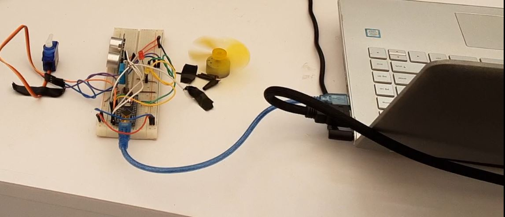

# (Samaritan) - AI Personal Assistant For Home Automation Using Python and Arduino


Samaritan is an AI Personal Assistant built with the Python Programming language and interfaced with the Arduino microcontroller for controlling electrical/electronic components (e.g. fan, lamps etc.) 
Employs computer vision specifically, facial recognition, to identify its user as well as speech recognition algorithms to make meaning of the commands given by the user and then communicates with the Arduino microcontroller for the required actuation to be executed

## Acknowledgements
In order to build this project, I found various resources from different instructors for implementing the different aspects of the project which come together to make the entire project function as it should.
 - [Kevin McAleer](https://github.com/kevinmcaleer): As a first step, I had to build an AI backbone (that is an AI class with the relevant methods). By following the first tutorial of his [Build Your Own AI Personal Assistant](https://www.youtube.com/playlist?list=PLU9tksFlQRirGvp7qOGrrU1PwcjgV8TG1) playlist, I was able to create my AI assistant.
 - Paul McWhorter: Another useful feature to be implemented was to allow for communication between Python and Arduino. By following the third tutorial video of his [Using Python With Arduino](https://www.youtube.com/playlist?list=PLGs0VKk2DiYzWURfJCbCGPa8HI0APjBfo) Youtube Playlist, I was able to write the relevant code to ensure that there was successful communication between Python and Arduino

## Authors

- [@ziegler121](https://www.github.com/ziegler121)

## Things used in this project
### Hardware Components
- Raspberry Pi (preferably); but can also be done on a PC (Windows, Mac, or Linux)
- Microphone - to enable Python hear speech
- Speaker - since we need to hear what is being said
- Arduino Nano
- LEDs
- DC Motor
- Servo Motor
- DHT 11 Temperature and Humidity Sensor
- Breadboard

### Software Apps and Online Services
- [Arduino IDE](https://www.arduino.cc/en/software)
- [Visual Studio Code](https://code.visualstudio.com/download)
- [Python](https://www.python.org/downloads/) : For this project, python version 3.7.9 was utilized

## Architecture
The Architecture used for this particular AI Assistant is quite a simple one with three major components:
- Speech Engine: Useful for recognizing words from audio data as well as making the AI Assistant say things back. (ie. Speech-to-Text and Text-to-Speech functions)
- Facial Recognition: This allows the system to give access to only a particular set of recognized faces.
- Home Automation Skill: This is where the Arduino Microcontroller is utilized to perform certain automation functions based on what the user says it should do

### Creating the AI backbone (implementing the Speech Engine)
#### Methodology
1. ***Creating Virtual Environment***: It is appropriate to create a virtual environment for this particular project to ensure that installations done within this project do not interfere with other versions of python installed on the system.

Open your project folder within a terminal (perferably VS Code terminal) and in your working directory, make the virtual environment using:
```bash
  py -3.7 -m venv [name of virtual env]
```
Then activate the virtual environment using:
```bash
  [name of virtual env]/Scripts/activate
```
***NOTE***: Make sure the right Virtual Environment interpreter is selected in VS Code

There is the need to also install some other libraries at this stage using:
```bash
  pip install pyttsx3
  pip install speechrecognition
  pip install pyaudio
```
